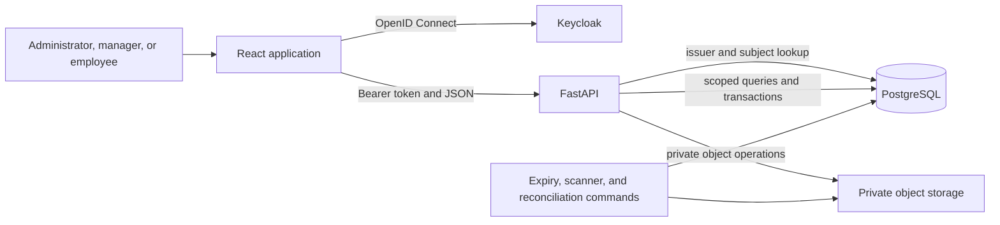

# Workloop Clinic architecture

## System boundary

Workloop has one application runtime. The React browser application authenticates with Keycloak and
calls FastAPI. FastAPI owns every business operation, database query, authorization decision, and
private-file operation. PostgreSQL and object storage are never exposed to the browser.

## Frontend

`src/` contains the canonical React application. `src/config.js` reads the six public settings listed
in `.env.example`. `src/api/` contains the HTTP client and domain clients. Screens do not connect to
the database or object store.

The production command is `npm run build`, which writes `dist/`. The development and preview
commands use the same source graph and configuration contract.

## Authentication and authorization

Keycloak performs interactive sign-in and issues access tokens for the `workloop-api` audience. The
frontend stores OIDC session state through `oidc-client-ts` and attaches the token to API requests.

FastAPI validates the issuer, audience, signature, time claims, and token type. It then resolves the
issuer and subject to an active application user in PostgreSQL. API dependencies enforce the
administrator, manager, or employee role and the applicable company, branch, and employee scope.
The interface may hide unavailable actions, but the API remains the security boundary.

## API and business operations

Routers under `backend/app/*_api.py` expose versioned routes under `/api/v1`. Repository and service
code performs scoped queries and transactional writes. Mutation endpoints use explicit request
schemas, concurrency checks where needed, and idempotency controls for retryable operations.

The application covers organization, employees, leave, attendance, roster, payroll, documents,
supporting HR modules, notifications, tasks, reports, exports, and rendered output. Public health
checks are limited to service readiness. Business routes require a valid identity and scope.

## Database

PostgreSQL 17 stores both application data and Keycloak data in separate databases. Alembic owns the
application schema. `backend/alembic/versions/` is append-only and currently has one head. Runtime,
migration, expiry, storage reconciliation, and file-scanning processes use separate database roles
with different grants.

Tenant isolation is enforced in application-owned repositories and protected database functions.
The test suite covers role denial, cross-company denial, branch scope, guarded mutations, concurrent
writes, and migration repeatability.

## Private files

FastAPI issues and validates file operations. Local development uses a private synthetic adapter.
The full storage gate uses an S3-compatible service through the same backend interface. Object keys
are opaque, signed access is time-limited, and scanner and reconciliation commands use their own
credentials.

The database records file state and integrity metadata. Restart checks compare database state,
stored objects, and signing-key identity before and after services restart.

## Background commands

- The expiry command creates time-based notifications through a restricted database role.
- The file scanner reads quarantined objects, records scan evidence, and controls release state.
- The storage reconciler compares database and object-store state without granting the API broad
  repair rights.

These commands are explicit Compose profiles or scheduled deployment jobs. They are not hidden work
inside the browser.

## Build and delivery

GitHub classifies changed paths and routes backend, frontend, database, authentication, and
full-stack checks. The repository guard runs for every change. Changes to workflow controls use the
complete local and hosted gate because they can alter which proof runs.

DigitalOcean deployment is not complete yet. The approved target keeps the same boundaries: a
static frontend, FastAPI service and workers, managed PostgreSQL, Keycloak, and private
S3-compatible object storage. `DIGITALOCEAN_MIGRATION_PLAN.md` records the deployment and recovery
requirements.

## Historical records

`docs/migration/phase-0/` through `phase-12/` describe earlier repository states. `docs/history/`
contains inert SQL and generated feature material from the retired source system. Neither location
is an active setup, bootstrap, fixture, or deployment input.
