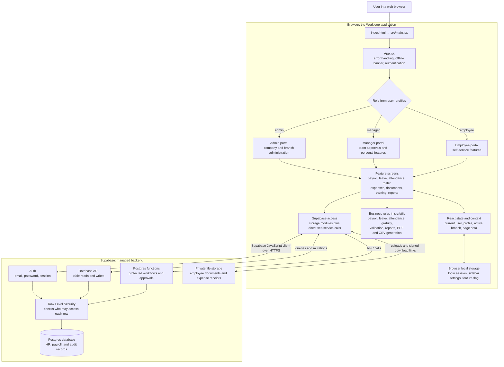
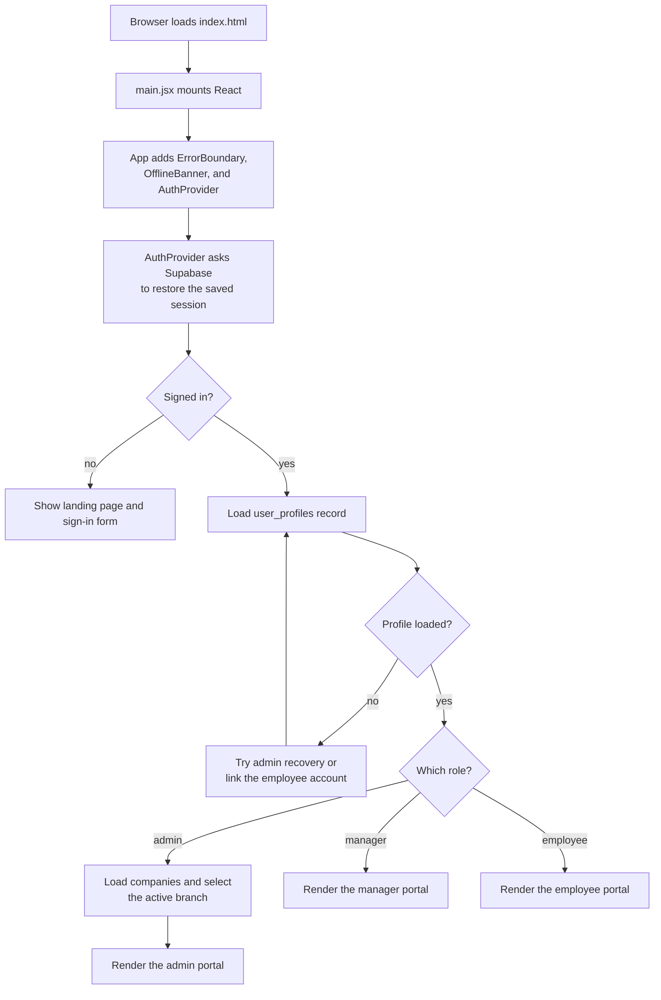
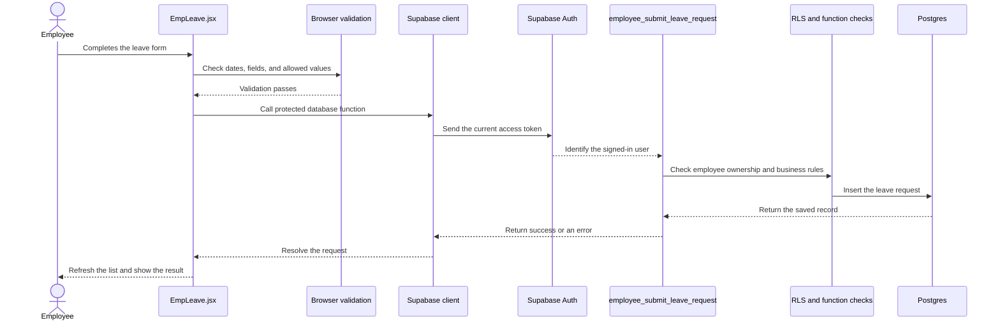

# Workloop Clinic Architecture

This guide explains the application from the outside in. You do not need to know React, Supabase, or this repository before reading it.

## What the application is

Workloop Clinic is a web-based HR and payroll system for UAE clinics and small hospitals. One application provides three different portals:

- **Admin:** manages companies, employees, payroll, leave, attendance, compliance, and reports.
- **Manager:** reviews work for direct reports and uses the employee features for their own account.
- **Employee:** views personal records and submits leave, expenses, documents, and other requests.

The application is a **single-page application**. After the first page load, React changes the visible screen without requesting a new HTML page. There is no custom application server between the browser and Supabase.

## Application stack



### How to read the diagram

1. The user opens the built HTML, CSS, and JavaScript in a browser.
2. React starts at `src/main.jsx`, then `src/App.jsx` restores the user's session.
3. The profile's role selects the admin, manager, or employee portal.
4. A feature screen calls JavaScript from `src/utils` to apply business rules and access data.
5. The Supabase client sends HTTPS requests directly from the browser to Supabase.
6. Supabase Auth identifies the user. Row Level Security and protected database functions decide what that user may read or change.
7. React stores the returned data in memory and redraws the screen.

The role-specific portal controls what the interface shows. It is not the final security boundary. Supabase Row Level Security and database functions must still reject unauthorized requests because browser code can be inspected or changed by a user.

## What happens when the application opens



Navigation inside each portal is React state rather than URL routing. Clicking a sidebar item changes the component on screen. As a result, the browser address does not identify the current feature, refreshing returns to the default screen, and Back or Forward does not move between feature screens.

## What happens during a typical change

This example follows an employee submitting leave. Other features use the same broad path, although an admin table update may use the database API instead of a protected function.



Important consequences of this flow:

- Client validation gives quick feedback, but server-side checks remain necessary.
- Most screens fetch data when they mount and refresh after a change. There is no shared query cache.
- The application does not use Supabase Realtime. Notifications and other changing data use explicit refreshes or periodic polling.
- Losing the network shows an offline banner, but the application does not queue changes for later synchronization.

## Responsibilities by layer

| Layer | Responsibility | Main locations |
|---|---|---|
| Build and entry | Starts the development server, creates the production bundle, and mounts React | `package.json`, `vite.config.js`, `index.html`, `src/main.jsx` |
| Application shell | Restores authentication, selects a role portal, and controls navigation | `src/App.jsx`, `src/components/ManagerShell.jsx`, `src/components/employee/EmployeeShell.jsx` |
| Shared state | Holds the signed-in user, role profile, companies, and active admin branch | `src/context/AuthContext.jsx`, `src/context/CompanyContext.jsx` |
| Feature screens | Display data, collect input, and start user actions | `src/components/` |
| Business logic | Calculates payroll, leave, attendance, gratuity, reports, and exports | `src/utils/*Calculator.js`, `src/utils/*Engine.js`, `src/utils/reportUtils.js`, `src/utils/uaeValidators.js` |
| Data access | Converts UI data to database rows and calls tables, functions, or file storage | `src/utils/*Storage.js`, `src/utils/storage.js`, some employee components |
| Backend connection | Creates the one shared Supabase client from environment variables | `src/lib/supabase.js` |
| Backend and security | Stores records, authenticates users, enforces permissions, and runs protected workflows | `supabase_schema.sql`, `supabase_*_schema.sql`, `sql/*.sql` |
| Automated checks | Tests selected pure utilities; package scripts also reference Playwright tests | `tests/`, `eslint.config.js`, `package.json` |

## Main data groups

The database contains many tables, but they fall into a few understandable groups:

- **Identity and organization:** companies, user profiles, employees, departments, and reporting lines.
- **Pay and expenses:** payroll runs, payroll entries, payslips, salary advances, repayments, and expense claims.
- **Time away and time worked:** leave types, requests, balances, shifts, clock events, attendance records, rosters, and shift swaps.
- **Employee lifecycle:** contracts, documents, insurance, assets, appraisals, training, certifications, incidents, and offboarding.
- **Supporting records:** notifications, approval logs, compliance overrides, and other audit data.

Most rows belong to a company or employee. Supabase policies use the authenticated user, company ownership, employee identity, and manager reporting relationships to limit access.

## Important libraries

| Library | Purpose |
|---|---|
| React | Builds the interface and manages in-browser state |
| Vite | Runs the development server and builds static production files |
| Supabase JavaScript | Connects the browser to Auth, Postgres, database functions, and file storage |
| jsPDF | Generates payslip and report PDFs in the browser |
| PapaParse | Reads and writes CSV data |
| fflate | Creates ZIP files for bulk payslip downloads |
| DOMPurify | Sanitizes generated HTML before opening printable content |
| Lucide React | Supplies interface icons |

## Where to start reading the code

Read these files in order:

1. `src/main.jsx` shows where React starts.
2. `src/App.jsx` shows session handling, role selection, admin navigation, and the top-level wrappers.
3. `src/context/AuthContext.jsx` shows sign-up, sign-in, session restoration, and profile loading.
4. `src/components/employee/EmployeeShell.jsx` and `src/components/ManagerShell.jsx` show the other two portals.
5. Pick one screen in `src/components/`, then follow its imports into `src/utils/`.
6. `src/lib/supabase.js` shows how every browser request reaches Supabase.
7. `sql/` shows the database tables, policies, and protected functions that complete the feature.

## Build and deployment

Vite compiles the React source into static files in `dist/`. Those files can be served by a static web host. The deployed application needs these build-time environment variables:

```text
VITE_SUPABASE_URL
VITE_SUPABASE_ANON_KEY
```

The anonymous key is expected to be present in browser code. It does not grant unrestricted access; database policies are responsible for protecting records. Database changes are separate from the frontend build and are applied from the SQL files in this repository.
