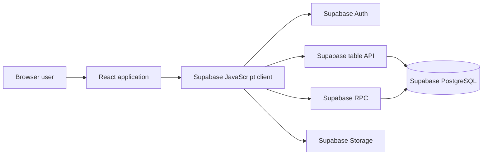
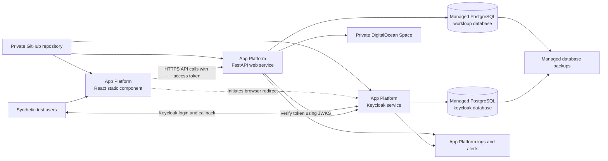
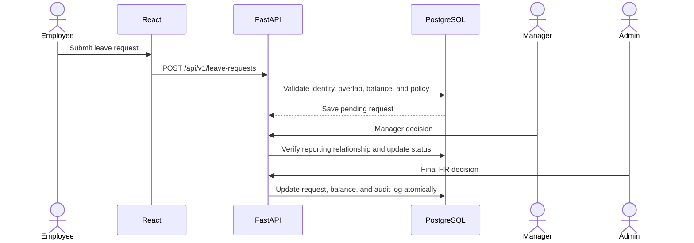

# DigitalOcean Migration Plan

## Purpose

This document is the working plan for replacing Workloop Clinic's Supabase backend with a portable FastAPI backend and running the development system on DigitalOcean.

Use this file as the source of truth in future sessions. A useful instruction is:

> Read `DIGITALOCEAN_MIGRATION_PLAN.md`, check the current repository state, and continue the next incomplete phase. Do not skip its completion gate.

Update the phase status, decision log, and test evidence as work progresses. Do not mark a phase complete because code was generated. Mark it complete only after its completion gate passes.

## Confirmed Decisions

| Topic | Decision |
|---|---|
| Current application | React 19 and Vite frontend using Supabase directly |
| New backend | FastAPI |
| Database | DigitalOcean Managed PostgreSQL during development |
| Authentication | Self-hosted Keycloak using standard OpenID Connect |
| File storage | Private DigitalOcean Spaces buckets |
| Frontend hosting | DigitalOcean App Platform |
| Backend hosting | DigitalOcean App Platform |
| Source control | Private GitHub repository |
| DigitalOcean connection | GitHub repository is not connected yet |
| DigitalOcean access | Team can grant or provide resource-creation permissions |
| Development address | Default `ondigitalocean.app` addresses are acceptable |
| Budget | Reasonable development spend is acceptable; add budget alerts before provisioning |
| Current data | No real clinics, production users, or production records exist |
| DigitalOcean purpose | Development and staging only, using synthetic data |
| Final destination | Azure in an approved UAE region before real clinic use |
| Migration strategy | Keep a separate legacy Supabase build as reference; the migration build uses Keycloak and exposes only dependency-complete FastAPI features |

## Non-Negotiable Boundaries

- Do not enter real employee, patient, payroll, banking, passport, visa, medical, insurance, or clinic data into DigitalOcean.
- Do not treat DigitalOcean as the final production environment without a new legal and security decision.
- Do not expose PostgreSQL directly to the browser.
- Do not store database passwords, Keycloak administrator credentials, Spaces keys, or API tokens in Git.
- Do not put secrets in variables beginning with `VITE_`; Vite exposes those variables to browser users.
- Do not write a custom password system inside FastAPI.
- Do not remove the working Supabase implementation until the replacement passes the relevant tests.
- Do not move to the next feature solely because its happy path works. Permission and failure-path tests must pass.
- Do not let the browser choose its trusted role, company, employee identity, or manager scope.
- Do not make one running frontend switch between Supabase and Keycloak sessions. Legacy and migration builds have separate entry points and authentication systems until final cutover.
- Do not start Phase 1 or any later phase until the project owner explicitly authorizes that phase.

## Phase Execution Protocol

Every phase requires separate authorization. Completing one phase does not authorize the next phase.

When the project owner authorizes a numbered phase and explicitly permits automatic subpart
progression, the AI may continue from one completed subpart to the next only when the next subpart
requires no owner decision, manual action, account or permission change, cost approval, security
approval, destructive approval, or externally visible action. Commit and push each successful
subpart before continuing. Stop at any such decision or action, and always stop before the next
numbered phase.

### Before a Phase

The AI must explain, in beginner-oriented steps:

- The phase objective and why it is needed.
- What will change and what will remain unchanged.
- Every action the project owner must perform personally.
- Required accounts, permissions, software, URLs, and non-secret identifiers.
- Which secrets will be created, where they belong, and what must not be pasted into chat or committed.
- Expected DigitalOcean or third-party cost changes.
- Risks, backups, rollback boundaries, and the phase completion gate.
- Which actions can be completed by AI and which require the project owner or team owner.

The AI must wait for confirmation when an account, billing, permission, legal, security, destructive, or externally visible action is required.

### During a Phase

- Give the project owner exact instructions immediately before each required manual action.
- State what successful output should look like and what non-secret information can be returned for verification.
- Never request passwords, private keys, full connection strings, access tokens, recovery codes, or payment details in chat.
- Stop and explain unexpected cost, permission, security, or destructive consequences before continuing.
- Keep the phase tracker and progress evidence current.

### After a Phase

The AI must report:

- Files and infrastructure changed.
- Commands and tests run, including failures.
- Resources created and their estimated ongoing cost.
- Secrets created and their storage location, without revealing values.
- Remaining risks, deferred work, and rollback status.
- Whether the completion gate passed and the evidence supporting it.
- The project owner's required checks or cleanup.

The AI must then stop. It may describe the next phase, but it must not begin that phase without explicit authorization.

### Model Selection and Handoff

At the end of every completed phase or subpart, recommend the model for the next subpart:

- Use GPT-5.6 for security-sensitive, authentication, authorization, database-schema, financial,
  destructive, ambiguous, or difficult debugging work where design or independent security review
  is still required.
- Use GPT-5.6 Terra for complex implementation with an approved design, including bounded schema
  migrations, cross-service integration, and substantial test work where cost efficiency matters.
- Use Sonnet 5 for lower-risk documentation, isolated UI work, routine scaffolding, repetitive
  conversions, and straightforward tests.

State the next subpart's complexity and give one concrete reason for the recommendation. Recommend
switching models only after the current work is committed, pushed, synchronized, and passing its
required checks.

Provide a ready-to-use handoff prompt that tells the next model to read the governing migration
documents, inspect Git and the relevant code, confirm the expected phase state, preserve security
and data boundaries, run the required tests, update documentation, commit and push successful
work, and stop at every owner decision required by this protocol. A handoff prompt does not
authorize the next phase or subpart.

## Current Architecture

The current React application runs in the browser and uses the Supabase JavaScript client for four services:

1. Supabase Auth identifies users and stores login sessions.
2. Supabase PostgREST exposes database tables to browser queries.
3. Supabase RPC exposes protected PostgreSQL functions.
4. Supabase Storage stores private documents and receipts.



The replacement must cover all four services. Moving tables alone would leave the application without login, an API, authorization, or file storage.

## Target DigitalOcean Architecture



For development, the Workloop and Keycloak databases may use one managed PostgreSQL cluster with separate databases and separate database users. They must not share credentials. Revisit physical separation before production on Azure.

## Responsibilities After the Change

| Layer | Responsibility |
|---|---|
| React | Display screens, collect input, call FastAPI, and perform non-authoritative previews |
| Keycloak | Register and authenticate users, reset passwords, issue tokens, and manage sessions |
| FastAPI | Validate tokens, enforce permissions, validate requests, run workflows, access data, and authorize files |
| PostgreSQL | Persist records, enforce constraints, execute transactions, and optionally provide row-level defense in depth |
| DigitalOcean Spaces | Store private binary files such as employee documents and expense receipts |
| Alembic | Create and upgrade the PostgreSQL schema consistently |
| GitHub | Store source code and trigger deployments |
| DigitalOcean | Run development infrastructure, logs, networking, and managed database backups |

## Portability Requirements

DigitalOcean is an intermediate environment. The implementation must avoid unnecessary DigitalOcean dependencies so the later Azure move changes infrastructure adapters rather than business features.

- Use standard PostgreSQL supported by both DigitalOcean and Azure PostgreSQL Flexible Server.
- Use SQLAlchemy and Psycopg for application database access.
- Use Alembic for every schema change after the baseline.
- Use standard OIDC and JWT validation for Keycloak integration.
- Keep roles and company relationships in the Workloop database, not only in Keycloak.
- Put object storage behind a small application interface.
- Use the S3-compatible implementation for DigitalOcean Spaces.
- Add an Azure Blob implementation later without changing feature services.
- Package FastAPI and Keycloak as containers.
- Read provider addresses and credentials from environment variables.
- Avoid DigitalOcean SDK calls in payroll, leave, attendance, or other domain code.
- Store infrastructure definitions in the repository using Terraform or another agreed infrastructure-as-code tool.

## Proposed Repository Shape

The exact names may be adjusted once implementation starts, but responsibilities should remain separated.

```text
workloop-clinic/
  src/                          Existing React frontend
  backend/
    app/
      main.py                   FastAPI startup
      api/                      Versioned HTTP routes
      auth/                     OIDC token verification and permission dependencies
      core/                     Configuration, logging, and shared errors
      db/                       SQLAlchemy session and shared database behavior
      models/                   SQLAlchemy table models
      schemas/                  Pydantic request and response models
      repositories/             Scoped database queries
      services/                 Business workflows and transactions
      storage/                  Object-storage interface and Spaces adapter
    alembic/                    Database migration files
    tests/                      Backend unit, API, and authorization tests
    Dockerfile
    pyproject.toml
  keycloak/
    Dockerfile                  Pinned Keycloak image and startup configuration
    realm/                      Sanitized development realm configuration if appropriate
  infra/
    digitalocean/               Development infrastructure definitions
    azure/                      Added during the final hosting migration
  docs/
  docker-compose.yml            Local PostgreSQL, Keycloak, and backend
  .env.example                  Names only; no credentials
```

Do not create abstractions merely to match this diagram. Start with the smallest structure that preserves the security and portability boundaries.

## Phase Tracker

| Phase | Name | Status | Estimated effort |
|---|---|---|---:|
| 0 | Baseline and inventory | Completed 2026-08-27 | 2–4 days |
| 1 | DigitalOcean access and cost controls | Completed 2026-08-27 — spend alert deferred to Phase 6A gate | 1–2 days |
| 2 | Local backend and infrastructure foundation | Completed 2026-08-31 | 4–7 days |
| 3 | Keycloak authentication foundation | Phase 3A through Phase 3G completed; Phase 3H local gate passed, GitHub confirmation pending | 1–2 weeks |
| 4 | Portable database baseline | Not started | 1–2 weeks |
| 5 | Authorization and tenant isolation | Not started | 1–2 weeks |
| 6 | Shared API and frontend client | Not started | 3–5 days |
| 6A | Early DigitalOcean architecture proof | Not started | 3–5 days |
| 7 | Organization and employee module | Not started | 1–2 weeks |
| 8 | Leave vertical slice | Not started | 1–2 weeks |
| 9 | Payroll, advances, and expenses | Not started | 3–4 weeks |
| 10 | Attendance, biometric import, and roster | Not started | 2–3 weeks |
| 11 | Documents and supporting HR modules | Not started | 3–5 weeks |
| 12 | Notifications, tasks, reports, and exports | Not started | 1–2 weeks |
| 13 | Remove Supabase runtime dependency | Not started | 3–5 days |
| 14 | DigitalOcean deployment and operations | Not started | 1–2 weeks |
| 15 | System validation and handoff | Not started | 2–4 weeks |

Estimates include implementation and focused testing. Phase estimates are effort ranges, not promises that every phase can overlap. Use a planning budget of 600–900 hours for the complete migration. At 40 focused hours per week, that is roughly 4–6 months. At 20 focused hours per week, it is roughly 7–11 months. Feature cuts can shorten this; behavior gaps, security defects, and learning time can extend it.

## Phase 0: Baseline and Inventory

### Objective

Record what the current application does before changing its backend.

### Work

- Run and record the current unit tests, lint command, and production build.
- Record any existing failures without hiding or deleting them.
- Create a feature checklist for the admin, manager, and employee portals.
- Inventory every Supabase table query, RPC call, Auth call, and Storage call.
- Map each frontend operation to its tables, functions, and file buckets.
- Inventory the SQL files in execution order.
- Identify PostgreSQL extensions and Supabase-specific schemas in use.
- Record current request and response shapes used by React.
- Create synthetic fixtures for at least two companies, two managers, and several employees.
- Preserve the current Supabase version as the behavioral reference.
- Decide the infrastructure-as-code tool, supported PostgreSQL version, RLS approach, object-upload method, and criteria for keeping SQL functions.
- Decide which exports remain in the browser and whether any scheduled jobs are required.
- Assign an owner for infrastructure, Keycloak, database releases, application releases, recovery, billing, security review, and Supabase deletion.

### Current Known Scope

The source currently contains at least:

- 77 direct `supabase.from(...)` entry points.
- 32 direct `supabase.rpc(...)` calls.
- 28 direct Supabase Auth calls.
- 13 direct Supabase Storage references.
- 14 feature-specific `*Storage.js` modules, plus the large shared `storage.js` module.

These counts are navigation aids, not API endpoint estimates. Fluent query chains and indirect helper calls make the true workflow count larger.

### User Actions

- Confirm the synthetic organization names and test personas.
- Identify any feature that can be removed instead of migrated.
- Confirm which behavior in the current application is authoritative if documentation and code disagree.

### Deliverables

- [`docs/migration/phase-0/README.md`](docs/migration/phase-0/README.md) — baseline report, decisions, ownership, known defects, and gate evidence.
- [`docs/migration/phase-0/SUPABASE_DEPENDENCY_INVENTORY.md`](docs/migration/phase-0/SUPABASE_DEPENDENCY_INVENTORY.md) — Supabase dependency inventory.
- [`docs/migration/phase-0/SQL_SCHEMA_INVENTORY.md`](docs/migration/phase-0/SQL_SCHEMA_INVENTORY.md) — SQL schema and migration inventory.
- [`docs/migration/phase-0/FEATURE_AND_CONTRACT_MATRIX.md`](docs/migration/phase-0/FEATURE_AND_CONTRACT_MATRIX.md) — feature migration and frontend contract matrix.
- [`docs/migration/phase-0/SYNTHETIC_TEST_DATA.md`](docs/migration/phase-0/SYNTHETIC_TEST_DATA.md) — synthetic test-data specification.

### Completion Gate

Passed on 2026-08-27. Every visible portal feature has an owner phase, the current command baseline is recorded, and all Phase 0 artifacts are linked above.

## Phase 1: DigitalOcean Access and Cost Controls

### Objective

Prepare the team account without creating unmanaged resources or exposing secrets.

### Work

- Confirm permission to create App Platform apps, managed databases, Spaces, projects, VPCs, secrets, and API tokens.
- Create a dedicated DigitalOcean project for Workloop development.
- Connect the private GitHub repository to the DigitalOcean team.
- Grant DigitalOcean access only to the required repository when possible.
- Create a development branch policy and choose the deployment branch.
- Set a monthly budget target and billing alert.
- Choose one DigitalOcean region for App Platform, PostgreSQL, and Spaces where service availability permits.
- Record resource owners and deletion responsibility.
- Create a secret inventory without writing secret values into this file.

### Initial Cost Guardrail

Use a planning range of USD 50–150 per month for the shared development environment. Confirm actual prices in the DigitalOcean control panel before creation. Keycloak adds an always-running service and database workload, so the cheapest possible configuration may not be reliable enough even for shared testing.

### User Actions

- Ask the team owner to install or authorize the DigitalOcean GitHub application.
- Approve repository access.
- Confirm team permissions and budget alerts.
- Approve the chosen region and deployment branch.

### Deliverables

- [`docs/migration/phase-1/README.md`](docs/migration/phase-1/README.md) records the DigitalOcean project, GitHub integration, permission checklist, region, cost estimate, accepted alert deferral, secret inventory, ownership, and branch policy.

### Completion Gate

Passed on 2026-08-27 with a time-bound exception: the repository is visible to App Platform, required resource categories can be created, no credentials were committed, and the spend alert is deferred as a hard Phase 6A pre-provisioning checkpoint.

## Phase 2: Local Backend and Infrastructure Foundation

### Objective

Run React, FastAPI, PostgreSQL, and Keycloak locally using repeatable commands.

### Part Status

| Part | Scope | Status |
|---|---|---|
| 2A | Computer readiness | Completed 2026-08-27; see [`docs/migration/phase-2/READINESS.md`](docs/migration/phase-2/READINESS.md) |
| 2B | Backend scaffold | Completed 2026-08-27; see [`docs/migration/phase-2/BACKEND_SCAFFOLD.md`](docs/migration/phase-2/BACKEND_SCAFFOLD.md) |
| 2C | Local PostgreSQL | Completed 2026-08-31; see [`docs/migration/phase-2/LOCAL_POSTGRESQL.md`](docs/migration/phase-2/LOCAL_POSTGRESQL.md) |
| 2D | FastAPI service | Completed 2026-08-31; see [`docs/migration/phase-2/FASTAPI_SERVICE.md`](docs/migration/phase-2/FASTAPI_SERVICE.md) |
| 2E | Alembic foundation | Completed 2026-08-31; see [`docs/migration/phase-2/ALEMBIC_FOUNDATION.md`](docs/migration/phase-2/ALEMBIC_FOUNDATION.md) |
| 2F | Local Keycloak runtime | Completed 2026-08-31; see [`docs/migration/phase-2/KEYCLOAK_RUNTIME.md`](docs/migration/phase-2/KEYCLOAK_RUNTIME.md) |
| 2G | Tests and GitHub checks | Completed 2026-08-31; see [`docs/migration/phase-2/GITHUB_CHECKS.md`](docs/migration/phase-2/GITHUB_CHECKS.md) |
| 2H | Documentation and restart gate | Completed 2026-08-31; see [`docs/migration/phase-2/README.md`](docs/migration/phase-2/README.md) |

### Work

- Add the FastAPI project and a `/health` endpoint.
- Add structured application configuration loaded from environment variables.
- Add SQLAlchemy, Psycopg, Alembic, Pydantic, and Pytest.
- Add a production-oriented FastAPI container image.
- Add a pinned Keycloak container image.
- Add Docker Compose services for FastAPI, PostgreSQL, and Keycloak.
- Create separate local Workloop and Keycloak databases and users.
- Add readiness and health checks.
- Add JSON-compatible structured logging without sensitive request bodies.
- Add `.env.example` with variable names and safe examples only.
- Document startup, shutdown, migration, and test commands.
- Add CI checks for backend formatting, linting, migrations, and tests.

### Configuration Groups

```text
Application:
APP_ENV
APP_BASE_URL
FRONTEND_URL
LOG_LEVEL

Database:
DATABASE_URL

OIDC:
OIDC_ISSUER
OIDC_AUDIENCE
OIDC_JWKS_URL

Storage:
STORAGE_PROVIDER
STORAGE_BUCKET
STORAGE_ENDPOINT
STORAGE_REGION
STORAGE_ACCESS_KEY
STORAGE_SECRET_KEY
```

Do not use `VITE_` for backend-only settings.

### User Actions

- Install or approve the local prerequisites, including Docker Desktop and a supported Python version.
- Run the documented commands instead of relying only on AI output.
- Confirm that the local services can be stopped and restarted without losing expected development state.

### Deliverables

- Local development stack.
- FastAPI health endpoint.
- Backend test command.
- Container images.
- Local setup documentation.

### Completion Gate

Passed on 2026-08-31. A fresh checkout installed locked Python and npm dependencies, started
PostgreSQL, FastAPI, and Keycloak with isolated synthetic credentials, ran Alembic, passed local
and GitHub foundation checks, and reached every health endpoint. A non-destructive main-stack
restart preserved the Keycloak realm, administrator, and signing keys. See
[`docs/migration/phase-2/README.md`](docs/migration/phase-2/README.md).

## Phase 3: Keycloak Authentication Foundation

### Objective

Replace Supabase Auth with a standards-based Keycloak login while keeping business roles in PostgreSQL.

This phase applies to the separate migration build, not the legacy Supabase build. The legacy build continues using Supabase Auth so its unmigrated queries, RPCs, and storage policies still receive a valid Supabase identity. The migration build uses only Keycloak and FastAPI; it must not send a Keycloak token to Supabase or retain a hidden Supabase session.

### Part Status

| Part | Scope | Status |
|---|---|---|
| 3A | Authentication design | Completed 2026-08-31; see [`docs/migration/phase-3/AUTHENTICATION_DESIGN.md`](docs/migration/phase-3/AUTHENTICATION_DESIGN.md) |
| 3B | Minimal identity database schema | Completed 2026-08-31; see [`docs/migration/phase-3/IDENTITY_SCHEMA.md`](docs/migration/phase-3/IDENTITY_SCHEMA.md) |
| 3C | Keycloak realm and public clients | Completed 2026-08-31; see [`docs/migration/phase-3/KEYCLOAK_CONFIGURATION.md`](docs/migration/phase-3/KEYCLOAK_CONFIGURATION.md) |
| 3D | FastAPI token validation | Completed 2026-08-31; see [`docs/migration/phase-3/FASTAPI_TOKEN_VALIDATION.md`](docs/migration/phase-3/FASTAPI_TOKEN_VALIDATION.md) |
| 3E | Application-user resolution | Completed 2026-08-31; see [`docs/migration/phase-3/APPLICATION_USER_RESOLUTION.md`](docs/migration/phase-3/APPLICATION_USER_RESOLUTION.md) |
| 3F | Separate React migration build | Completed 2026-08-31; see [`SEPARATE_REACT_MIGRATION_BUILD.md`](docs/migration/phase-3/SEPARATE_REACT_MIGRATION_BUILD.md) |
| 3G | Synthetic login and account lifecycle | Completed 2026-09-01; see [`SYNTHETIC_LOGIN_AND_ACCOUNT_LIFECYCLE.md`](docs/migration/phase-3/SYNTHETIC_LOGIN_AND_ACCOUNT_LIFECYCLE.md) |
| 3H | Security, restart, and completion gate | Local gate passed 2026-09-01; GitHub confirmation pending |

### Identity Schema Prerequisite

Before role resolution and account-lifecycle tests, add minimal Alembic migrations for `app_users` and the core `companies`, `employees`, and `user_profiles` relationships required by identity mapping. These migrations establish application-owned IDs, issuer and subject fields, account status, roles, and nullable links needed during bootstrap. Phase 4 reviews and extends this baseline into the complete portable schema; it does not replace it.

### Keycloak Design

- Create one development realm for Workloop.
- Use a maintained OIDC client library with Authorization Code flow, PKCE using `S256`, `state`, and `nonce` validation.
- Create a public React client and an explicit FastAPI API audience.
- Configure an audience mapper so Keycloak access tokens contain the FastAPI audience.
- Do not put a client secret in React.
- Use exact local and App Platform redirect URLs.
- Restrict web origins to known frontend addresses.
- Disable implicit flow, Direct Access Grants, service accounts, wildcard redirects, and unnecessary client scopes for the React client.
- Configure access-token lifetimes appropriate for development and later review them for production.
- Enable email verification and password-reset actions once SMTP is available.
- Disable open public registration unless an approved onboarding workflow requires it.
- Protect the Keycloak administrator account with a unique secret and MFA where supported.
- Pin the Keycloak version and schedule dependency updates.
- Export only sanitized realm configuration. Never commit users, credentials, or private keys.

### Application Identity Model

Keycloak owns credentials. Workloop PostgreSQL owns application identity and permissions.

```text
Keycloak issuer + token `sub`
        ↓
app_users.identity_issuer + app_users.identity_subject
        ↓
user_profiles
        ↓
role + company_user_id + employee_id
```

`app_users.id` must be an application-owned UUID. `identity_issuer` and `identity_subject` must be text with a unique composite constraint. Business tables reference `app_users.id`, never the Keycloak subject directly. The subject is opaque even if its current value resembles a UUID. Email is useful for invitations and display, but must not be the permanent authorization key because email addresses can change.

### Account Lifecycle to Implement

- Bootstrap the first development administrator safely.
- Invite or provision an employee after an HR employee record exists.
- Link the Keycloak identity to exactly one application user.
- Promote an eligible employee profile to manager through an authorized admin workflow.
- Disable application access when employment ends.
- Handle changed email addresses without changing ownership.
- Handle password reset and email verification.
- Revoke or expire sessions when access is removed.
- Define how abandoned or duplicate Keycloak users are cleaned up.
- Model provisioning as an idempotent state machine such as `pending_identity`, `active`, and `disabled`.
- Use a backend-only confidential client with minimum Keycloak Admin API permissions when automated provisioning is introduced.
- Define retry, compensation, and reconciliation behavior when Keycloak succeeds but PostgreSQL fails, or the reverse.
- Check active application-user status on every request. Keycloak logout ends its session but does not instantly invalidate an already issued self-contained access token.

### FastAPI Authentication Work

- Read bearer access tokens from the `Authorization` header.
- Retrieve and cache Keycloak public signing keys from JWKS with bounded HTTP and cache timeouts.
- Validate token signature, issuer, audience, expiry, and required claims.
- Allow only the configured asymmetric signing algorithm; reject `none`, symmetric algorithms, and token-selected algorithm changes.
- Refresh JWKS once for an unknown key ID to support signing-key rotation, then fail closed.
- Reject ID tokens when an access token is required.
- Resolve the application user from the verified token subject.
- Return consistent `401 Unauthorized` and `403 Forbidden` responses.
- Do not accept role or company claims without a documented trust decision.

### React Authentication Work

- Establish the separate migration-build entry point and configuration before adding OIDC. Add an automated check that it cannot initialize or import the Supabase client.
- Create a migration-build authentication context using an OIDC client with PKCE.
- Leave the legacy build's Supabase authentication unchanged until final cutover.
- Restore login state after page refresh.
- Prefer in-memory token storage. Any persistent browser storage requires a documented XSS and refresh-token review.
- Attach access tokens to FastAPI requests.
- Handle token expiry, refresh-token rotation, callback replay, and silent renewal safely.
- Implement sign-out from both React and Keycloak.
- Handle callback, cancellation, and authentication error states.
- Remove Supabase password-reset behavior only after the Keycloak flow works.

### Tests

- Valid access token is accepted.
- Expired token is rejected.
- Wrong issuer is rejected.
- Wrong audience is rejected.
- Wrong state or nonce and replayed authorization codes are rejected.
- Unknown signing key, disallowed algorithm, and malformed claims are rejected.
- Signing-key rotation and a temporary JWKS outage follow the documented cache and fail-closed behavior.
- Missing token is rejected on protected routes.
- Disabled application user is rejected.
- Changed email does not change record ownership.
- Logout behavior matches the documented token lifetime, and a disabled application user is rejected immediately even with an otherwise valid token.

### Completion Gate

Synthetic admin, manager, and employee identities can sign in through the isolated migration build; the restricted React client issues the explicit API audience; FastAPI identifies each through issuer and subject; invalid and replayed authentication responses fail closed; disabled users are blocked; the legacy build still authenticates independently; and passwords never enter the Workloop database.

## Phase 4: Portable Database Baseline

### Objective

Translate the Supabase-oriented schema into a versioned, portable PostgreSQL schema.

### Work

- Choose and document the supported PostgreSQL version.
- Build an ordered schema inventory from root SQL files and `sql/*.sql`.
- Convert the schema baseline into Alembic migrations.
- Preserve primary keys, foreign keys, unique constraints, checks, indexes, and audit fields.
- Use `NUMERIC`, not floating point, for money.
- Store timestamps consistently in UTC and convert only for display.
- Confirm UUID generation works on DigitalOcean and Azure PostgreSQL.
- Identify every use of `auth.uid()`, `auth.users`, `storage.objects`, and Supabase-specific helpers.
- Convert every `auth.users`, `auth_user_id`, and auth-owned `user_id` relationship to the application-owned identity model explicitly.
- Replace or remove Supabase-specific dependencies deliberately.
- Decide which PostgreSQL functions remain and which move into FastAPI services.
- Add repeatable synthetic seed data separate from schema migrations.
- Compile the Phase 0 scenario catalogue into an exact version-controlled fixture manifest before implementing the seed.
- Verify both upgrade and clean-database creation paths.

### Migration Rules

- Alembic migrations are append-only after they are shared.
- Never edit an applied migration to hide a correction; add a new migration.
- Seed scripts must be safe for development and must not contain real personal data.
- Schema creation must not depend on manually running SQL in a cloud console.
- Database credentials must use least privilege.
- The FastAPI runtime user should not own the database or have migration privileges.
- A separate migration identity should apply schema changes.

### Supabase-Specific Areas Requiring Attention

- `auth.uid()` calls in policies and functions.
- `auth.users` references.
- Security-definer functions that infer the caller from Supabase JWT state.
- PostgREST relationship syntax used by frontend queries.
- Storage bucket policies and `storage.objects` references.
- Grants written specifically for Supabase `anon`, `authenticated`, or `service_role` roles.
- Any extension not available in both target PostgreSQL services.

### Completion Gate

Alembic can create an empty Workloop database from scratch and upgrade it to the latest schema without Supabase schemas, roles, or services.

## Phase 5: Authorization and Tenant Isolation

### Objective

Rebuild the security boundary currently provided by Supabase Row Level Security and protected functions.

### Authorization Model

FastAPI must derive trusted context from the authenticated application user:

```text
authenticated subject
        ↓
application user
        ↓
role
        ↓
company owner or employee identity
        ↓
allowed records and actions
```

The browser may request a resource ID, but the server must prove that the resource belongs to the caller's permitted company or employee scope.

### Work

- Define reusable FastAPI dependencies for authenticated user, admin, manager, employee, and active company scope.
- Put company and employee scoping inside repository queries, not only route handlers.
- Implement manager scope through authoritative reporting relationships.
- Prevent mass-assignment of restricted columns such as role, salary, company owner, and approval status.
- Add database constraints that protect invariants even if API validation fails.
- Decide whether to retain PostgreSQL RLS as defense in depth.
- If retaining RLS, use transaction-local request context and test connection-pool isolation carefully.
- Create audit events for role changes, approvals, payroll state changes, and sensitive document actions.
- Return generic authorization errors without revealing whether another company's record exists.

### Required Permission Matrix

Create a version-controlled matrix covering every feature and operation. At minimum it must distinguish:

- Admin access within owned companies and branches.
- Manager access to direct reports and personal employee features.
- Employee access to personal records and self-service actions.
- System-only actions such as migration, scheduled jobs, and expiry processing.

### Required Negative Tests

- Company A admin cannot access Company B records by changing an ID.
- Employee A cannot access Employee B records or files.
- Manager A cannot access an employee outside the reporting line.
- Employee cannot change role, salary, approval status, or company ownership.
- Manager cannot approve their own restricted request when policy forbids it.
- Disabled user cannot access data with a valid identity-provider account.
- Guessed UUIDs and modified query strings do not bypass scope.
- Bulk endpoints enforce scope on every row.

### Completion Gate

The permission matrix is approved, reusable authorization code exists, and automated cross-company and cross-role tests fail closed.

## Phase 6: Shared API and Frontend Client

### Objective

Create stable conventions before converting business modules.

### API Conventions

- Prefix endpoints with `/api/v1`.
- Use Pydantic request and response schemas.
- Use consistent JSON field naming.
- Use consistent pagination, filtering, and sorting parameters.
- Return stable machine-readable error codes plus safe user messages.
- Add request correlation IDs for logs.
- Define transaction boundaries in service functions.
- Add idempotency protection where repeated financial or approval requests could duplicate work.
- Generate and review OpenAPI documentation.
- Limit request and upload sizes.
- Configure CORS for exact frontend origins rather than `*` on authenticated endpoints.
- Add rate limiting before public or production use.

### Frontend Client Conventions

- Create one HTTP client responsible for base URL, tokens, JSON parsing, timeouts, and normalized errors.
- Keep backend-only secrets out of React.
- Preserve existing storage-function interfaces where that reduces screen changes.
- Use a standard cancellation strategy for abandoned requests.
- Distinguish authentication, authorization, validation, conflict, and server errors.
- Avoid showing raw database or Python error messages to users.

### Compatibility Strategy

Run two explicit development entry points during migration:

- The legacy build uses Supabase Auth and Supabase-backed screens only. It remains a behavioral reference.
- The migration build uses Keycloak, FastAPI, and PostgreSQL only. It exposes migrated slices and disables or clearly marks unfinished screens.

Do not mix Supabase and Keycloak sessions in one running frontend. A Keycloak access token cannot authorize current Supabase queries because those policies depend on Supabase identity and `auth.uid()`.

The default cutover unit is a dependency-complete vertical slice: its UI, API, tables, files, and workflows move together. After a slice moves, disable its Supabase write paths. Do not maintain silent bidirectional synchronization.

Core records such as companies, employees, reporting relationships, and roles are shared dependencies. Until all consumers move, use a repeatable one-way synthetic-data refresh from the chosen source into the other development database, freeze edits in the non-authoritative copy, and display which system is authoritative. Record the source, refresh command, and last refresh time.

Each feature cutover requires:

- An authoritative-system declaration.
- A dependency checklist.
- A read and write freeze boundary.
- A repeatable synthetic-data refresh if old consumers remain.
- A rollback that routes the whole feature back, not individual requests.
- A check proving no screen writes the same business record to both databases.
- A mapping from legacy Supabase user IDs to application-owned IDs when synthetic reference data is refreshed.

### Completion Gate

The migration build can call authenticated and public FastAPI endpoints through one client, errors are consistent, CORS is restricted, and a sample protected endpoint passes integration tests. The legacy build still works independently with Supabase, and neither build holds or forwards the other build's token.

## Phase 6A: Early DigitalOcean Architecture Proof

### Objective

Prove the selected cloud architecture before investing in business-module conversion.

### Work

- Deploy the React shell with `npm ci`, `npm run build`, and `dist` as the static output.
- Deploy FastAPI with `/health` and one authenticated profile endpoint.
- Deploy one Keycloak replica in production mode with external managed PostgreSQL.
- Create separate Workloop and Keycloak databases and users.
- Verify App Platform TLS termination, proxy headers, fixed Keycloak hostname, issuer URL, callback URL, and health endpoints.
- Create one private test object in Spaces through FastAPI.
- Run one Alembic migration through a single-run pre-deploy job or explicitly invoked CI job.
- Restart and redeploy every component and prove that identities, schema, and the test object persist.
- Record actual monthly cost and resource sizes.

### Completion Gate

The deployed browser completes a real Keycloak login, calls the protected FastAPI endpoint, reaches managed PostgreSQL, stores and retrieves a private test object, survives redeployment, and exposes no wildcard callback, CORS, or public-storage access.

## Phase 7: Organization and Employee Module

### Objective

Move the core records on which every other feature depends.

### Scope

- Companies and branches.
- Company settings and feature toggles.
- Departments and staffing rules.
- Employees and employment status.
- Job history.
- Reporting-manager relationships.
- Salary and bank fields.
- UAE identity and compliance fields.
- Admin assignment of employee and manager portal access.

### API Examples

```text
GET    /api/v1/companies
POST   /api/v1/companies
GET    /api/v1/companies/{company_id}
PATCH  /api/v1/companies/{company_id}
GET    /api/v1/departments
POST   /api/v1/departments
GET    /api/v1/employees
POST   /api/v1/employees
GET    /api/v1/employees/{employee_id}
PATCH  /api/v1/employees/{employee_id}
POST   /api/v1/employees/{employee_id}/portal-access
```

### Critical Tests

- Company and branch switching never crosses ownership.
- Employee lists and counts are company-scoped.
- Email uniqueness and identity linking rules are explicit.
- Job and salary changes append the correct audit history.
- Manager assignment cannot reference an employee in another company.
- Employees cannot edit protected profile fields through crafted requests.
- CSV import validates and scopes every row.

### Completion Gate

The admin can manage synthetic organizations and employees through FastAPI, each test identity sees the correct profile, and no organization or employee screen requires Supabase.

## Phase 8: Leave Vertical Slice

### Objective

Prove a complete employee-to-manager-to-admin workflow using the new architecture.

### Scope

- Leave settings and statutory types.
- Public holidays.
- Leave balances and accrual.
- Employee submission and cancellation.
- Overlap detection.
- Manager approval and rejection.
- HR final approval and rejection.
- Delegation.
- Attachments.
- Audit log.

### Workflow



### Critical Tests

- Date, half-day, probation, holiday, and overlap rules match current behavior.
- Unauthorized managers cannot see or decide requests.
- Repeated approval requests do not deduct balance twice.
- Failed transactions do not leave partial balances or audit rows.
- Attachment authorization matches request authorization.
- Concurrent requests cannot overspend the same balance unnoticed.

### Completion Gate

A complete leave workflow passes all three roles, transaction tests, and authorization tests without Supabase.

## Phase 9: Payroll, Advances, and Expenses

### Objective

Move the financially sensitive workflows and make the server authoritative for persisted results.

### Scope

- Payroll runs and entries.
- Allowances and deductions.
- Approval states and audit logs.
- Compliance overrides.
- Payslip snapshots.
- Salary advances and repayment schedules.
- Expense claims, receipts, and approvals.
- Applying advances, overtime, and expenses to payroll.
- WPS status and SIF generation inputs.
- Nafis and Emiratization reporting inputs.

### Design Rules

- FastAPI must calculate or independently verify persisted payroll totals.
- Use decimal arithmetic and PostgreSQL `NUMERIC` for money.
- Financial transitions must be transactions.
- Approval endpoints must enforce valid state transitions.
- Repeated submissions must not create duplicate repayments or reimbursements.
- Payslips should use immutable snapshots after approval.
- The server must not trust company, employee, amount, or approval fields solely because React submitted them.
- Preserve client-side previews only as convenience, not authority.

### Golden Test Cases

Create reviewed examples with exact expected results for:

- Normal monthly payroll.
- Allowances and deductions.
- Approved overtime.
- Expense reimbursement.
- Advance repayment.
- Unpaid leave or attendance deduction.
- Employee joining or leaving mid-period.
- Gratuity and final settlement.
- Compliance override behavior.
- SIF totals and rounding.

### Completion Gate

Synthetic payroll completes from draft through approval and payslip generation; server totals match golden cases exactly; and retries, concurrent actions, and unauthorized actions do not corrupt financial data.

## Phase 10: Attendance, Biometric Import, and Roster

### Objective

Move time, attendance, shift, and roster workflows while preserving payroll integration.

### Scope

- Attendance settings.
- Shift templates and assignments.
- Clock events and manual entries.
- Attendance derivation.
- Regularisation requests and approvals.
- Attendance periods and closure.
- Biometric mappings and CSV punch import.
- Monthly rosters and publication.
- Staffing checks.
- Shift swaps.
- Overtime and absence deductions.

### Critical Tests

- UAE-local display and UTC persistence are consistent.
- Overnight shifts and month boundaries behave correctly.
- Duplicate biometric punches are handled safely.
- Imports report unmatched badges without corrupting matched rows.
- Regularisation validates event order and duration.
- Published roster restrictions work.
- Shift swaps are authorized and atomic.
- Attendance-derived payroll values match reviewed examples.

### Completion Gate

A complete synthetic month can move from roster through clock events, attendance review, period closure, and payroll inputs without Supabase.

## Phase 11: Documents and Supporting HR Modules

### Objective

Convert private files and the remaining domain modules.

### DigitalOcean Spaces Design

- Use a private Space.
- Disable CDN delivery, public listing, and public object ACLs.
- Keep Spaces access keys only in FastAPI secrets.
- Use the narrowest available credentials and document rotation.
- Use non-guessable object keys without personal names where practical.
- Store object metadata and ownership in PostgreSQL.
- Validate file size, extension, and detected content type.
- Sanitize displayed filenames.
- Authorize every upload, download, and delete operation.
- Stream development uploads through FastAPI so it controls the object key and inspects actual bytes before availability.
- Use short-lived signed download URLs only after FastAPI authorizes the request.
- Define malware-scanning expectations before real files are allowed.
- Log sensitive file actions without logging file contents or signed URLs.
- Use pending and deleting metadata states plus idempotent retries because PostgreSQL and Spaces cannot share one transaction.
- Add reconciliation for orphaned objects, missing objects, and incomplete deletion.
- Keep encrypted snapshot backups in a separate private backup target.
- Record retention, recovery point objective, recovery time objective, and restore owner.
- Test unauthenticated URLs, bucket listing, public ACL attempts, expired signed URLs, partial failures, and removal of both object and metadata.

### Storage Interface

```text
put_object(stream, metadata, conditions)
delete_object(object_id, conditions)
create_download_url(object_id, expires_in)
head_object(object_id)
list_reconciliation_candidates(...)
```

The interface must define provider-neutral metadata, stream behavior, size limits, not-found and conflict errors, and conditional-write behavior. The DigitalOcean adapter uses its S3-compatible API. A later Azure adapter will use Azure Blob Storage and must pass the same contract tests.

### Module Scope

- Employee documents.
- Expense receipts.
- Leave attachments.
- Training records and certification files.
- CME requirements.
- Insurance policies and dependants.
- Assets and assignments.
- Appraisal cycles, reviews, and calibration.
- Clinical incident reports.
- Contracts and renewals.
- Letter and custom requests.
- Offboarding and end-of-service workflows.

### Completion Gate

All supporting modules use FastAPI, private files are inaccessible without authorization, and storage-provider tests pass against local and DigitalOcean-compatible storage.

## Phase 12: Notifications, Tasks, Reports, and Exports

### Objective

Move cross-cutting reads, scheduled work, and generated outputs.

### Scope

- Notifications and unread counts.
- Expiry notification generation.
- Cross-module task aggregation by role.
- Dashboard aggregates.
- Clinical dashboard aggregates.
- Reports and filters.
- CSV exports.
- PDF and ZIP generation.
- SIF generation and downloads.

### Design Decisions

- Decide which exports remain browser-generated and which are server-generated.
- Keep sensitive report queries server-scoped even if rendering remains in React.
- Add background-job infrastructure only where a real requirement exists.
- If periodic jobs are needed, define one scheduler owner to prevent duplicate execution.
- Preserve polling initially; real-time updates are not required to complete the migration.
- Set report row limits, timeouts, and pagination.

### Completion Gate

Dashboards, tasks, notifications, reports, and exports return role-scoped results through FastAPI and match agreed synthetic reference outputs.

## Phase 13: Remove Supabase Runtime Dependency

### Objective

Prove that the application no longer requires any Supabase service at runtime.

### Work

- Search the entire repository, CI settings, GitHub environments, local examples, tests, and deployment configuration for Supabase dependencies and secrets.
- Promote the migration build to the only active application after every dependency-complete slice passes its gate.
- Remove the Supabase client after all call sites are replaced.
- Remove Supabase environment variables from active deployment configuration.
- Move any still-needed SQL into Alembic or backend-owned SQL modules.
- Remove `@supabase/supabase-js` from dependencies.
- Verify Auth, table, RPC, Realtime, and Storage services are unused.
- Update setup, architecture, deployment, and recovery documentation.
- Keep legacy SQL files only if clearly labeled as historical references.
- Run a clean setup without valid Supabase credentials.
- Revoke Supabase API keys and remove them from GitHub and DigitalOcean secret stores.
- Delete obsolete Supabase buckets and data after retaining only approved sanitized historical material.
- Have the named owner approve final Supabase project deletion after the no-network test and any required retention period.

### Completion Gate

The full application starts and passes its agreed tests with no Supabase project, URL, key, account, bucket, or network access.

## Phase 14: DigitalOcean Deployment and Operations

### Objective

Harden the early DigitalOcean proof into a repeatable shared development environment using default App Platform addresses.

### Recommended Resource Layout

- One DigitalOcean project named for Workloop development.
- One App Platform application for React and FastAPI, if route and deployment isolation remain manageable.
- One separately deployable Keycloak App Platform application or service.
- One managed PostgreSQL development cluster.
- Separate `workloop` and `keycloak` databases and users.
- One private Space for synthetic development files.
- One infrastructure-as-code state strategy with protected access.

### Deployment Work

- Connect the approved GitHub branch.
- Store a version-controlled App Platform specification where supported.
- Configure React as a static component using `npm ci`, `npm run build`, and `dist` as output.
- Configure SPA fallback to `index.html` and route `/api` to FastAPI before the frontend catch-all.
- Prefer a relative `/api` frontend URL when React and FastAPI share an App Platform application.
- Record public build-time API and OIDC variables separately from backend secrets.
- Configure FastAPI as a containerized web service.
- Configure Keycloak as a production-mode container, not `start-dev`.
- Pin runtime and container versions.
- Configure health checks and rolling deployment behavior.
- Add backend and Keycloak secrets through DigitalOcean settings.
- Add managed database trusted sources and encrypted connections.
- Configure exact CORS origins.
- Add App Platform addresses to Keycloak redirect URI and web-origin settings.
- Configure Keycloak proxy and hostname behavior for App Platform TLS termination.
- Add SMTP for verification and reset emails when those flows are tested.
- Configure Spaces credentials and CORS.
- Run Alembic once per release through an App Platform pre-deploy job or an explicitly invoked one-shot CI job using the migration identity. Never run migrations independently in every web-service replica.
- Apply backward-compatible expand, migrate, and contract releases so rolling deployments do not run old code against an incompatible schema.
- Stop deployment on migration failure and require named approval for destructive migrations.
- Add alerts for service failure, CPU, memory, database capacity, and budget.
- Confirm logs redact tokens, credentials, personal fields, and signed URLs.
- Document redeployment and rollback procedures.

### Keycloak Operational Checks

- Keycloak uses external PostgreSQL, not an ephemeral local database.
- Begin with one Keycloak replica for development and record memory limits and the expected service port.
- Use a fixed external hostname and strict issuer behavior.
- Trust forwarded proxy headers only through the App Platform boundary and use the internal HTTP listener behind platform TLS.
- Expose dedicated health and readiness endpoints.
- Realm data survives container replacement.
- Bootstrap administrator credentials are rotated after setup.
- Administrative endpoints are protected.
- Backup and restore include the Keycloak database.
- Token signing and realm configuration survive deployment.
- Keycloak version upgrades are tested in development before use elsewhere.
- Browser redirects and FastAPI issuer discovery resolve to the same external HTTPS address.

### Completion Gate

A GitHub change deploys predictably, all services recover from an application restart, Keycloak and Workloop data persist, alerts work, and the environment can be recreated from documentation and infrastructure code.

## Phase 15: System Validation and Handoff

### Objective

Demonstrate that the migrated development system is complete, secure within its stated scope, recoverable, and ready to become the basis for the Azure deployment.

### Portal Validation

Admin tests must cover organization, employees, payroll, leave, attendance, roster, expenses, advances, documents, training, appraisals, incidents, reports, tasks, and settings.

Manager tests must cover direct-report scope, leave and expense queues, appraisals, training, and personal employee functions.

Employee tests must cover profile, leave, schedule, attendance, payslips, advances, expenses, training, appraisals, documents, requests, and tasks.

### Security Validation

- Cross-company authorization tests.
- Cross-employee authorization tests.
- Manager-scope tests.
- Modified-ID and mass-assignment tests.
- Expired, malformed, wrong-issuer, and wrong-audience token tests.
- File upload and download authorization tests.
- SQL injection and unsafe-filter tests.
- CORS and browser-security configuration review.
- Dependency and container vulnerability scans.
- Secret scanning.
- Log-redaction review.
- Rate-limit and abuse-case review.
- Content Security Policy covering only required API, Keycloak, and file origins.
- Clickjacking, MIME-sniffing, referrer-policy, HTTPS redirect, and HSTS checks where the platform supports them.
- Deployed smoke tests against real Keycloak, managed PostgreSQL, and Spaces rather than mocks alone.
- Deployed signing-key rotation, token renewal, expired URL, unauthenticated object, restart, and redeployment tests.

### Recovery Validation

- Use provisional development objectives of a 24-hour recovery point and a 4-hour recovery time, then confirm them against actual service capabilities.
- Record backup retention, restore owner, restore frequency, and whether restoration is cluster-wide or database-specific.
- Restore the Workloop database into a fresh database.
- Restore the Keycloak database and verify login identity continuity.
- Restore development objects from the encrypted backup target.
- Restore both databases to a logically consistent point and verify identity-to-application linkage.
- Recreate application services from infrastructure definitions.
- Record recovery steps and actual recovery time.
- Verify that a failed migration can be rolled back or corrected safely.

### Performance Validation

- Define representative synthetic company and employee counts.
- Test dashboard and report query performance.
- Test payroll generation at representative size.
- Test concurrent login and common API requests.
- Check database connection-pool limits against managed database capacity.
- Add indexes based on measured queries, not guesses.

### Handoff Deliverables

- Updated architecture diagram.
- API documentation.
- Database migration documentation.
- Keycloak realm and account-lifecycle documentation.
- Permission matrix.
- Infrastructure inventory.
- Secret ownership list.
- Backup and recovery runbook.
- Known limitations and deferred work.
- Azure migration mapping.

### Completion Gate

The agreed automated and manual suites pass, restore procedures have been exercised, known limitations are documented, and the system contains only synthetic data.

## Feature Migration Matrix Template

Create and maintain the detailed matrix during Phase 0.

| Feature | Current frontend | Current Supabase dependency | New API | New tables/functions | Permission tests | Status |
|---|---|---|---|---|---|---|
| Authentication | `AuthContext.jsx` | Supabase Auth and `user_profiles` | OIDC callback/profile endpoints | `app_users`, `user_profiles` | All roles and invalid tokens | Not started |
| Companies | `CompanyContext.jsx`, settings | `companies` queries | `/api/v1/companies` | Company models and services | Cross-company isolation | Not started |
| Employees | Employee screens | Employee queries and role RPCs | `/api/v1/employees` | Employee models and services | Admin, manager, self | Not started |
| Leave | Leave screens | Tables, RPCs, attachments | `/api/v1/leave-*` | Leave services and transactions | Employee, manager, HR | Not started |
| Payroll | Payroll screens | Tables and replacement RPC | `/api/v1/payroll-*` | Payroll services | Admin and approval states | Not started |
| Attendance | Attendance screens | Tables and RPCs | `/api/v1/attendance-*` | Attendance services | Admin and self | Not started |
| Roster | Roster and schedule screens | Tables and shift-swap RPCs | `/api/v1/rosters` | Roster services | Admin, manager, self | Not started |
| Expenses | Expense screens | Tables, RPCs, receipt storage | `/api/v1/expenses` | Expense services | Employee, manager, HR | Not started |
| Documents | Document screens | Tables and Storage | `/api/v1/documents` | Metadata plus storage adapter | Admin and self | Not started |

## Testing Strategy

### Test Levels

| Level | Purpose |
|---|---|
| Pure unit tests | Verify calculations, validators, and state-transition rules quickly |
| Repository tests | Verify scoped SQL queries against PostgreSQL |
| API tests | Verify requests, responses, validation, transactions, and errors |
| Authorization tests | Prove forbidden cross-role and cross-company access |
| Contract tests | Keep React expectations aligned with FastAPI response shapes |
| Browser tests | Verify complete admin, manager, and employee workflows |
| Infrastructure tests | Verify health, secrets, networking, persistence, and redeployment |
| Recovery tests | Prove database, Keycloak, and object restoration |

### Test Data Rules

- Use unmistakably synthetic names and identifiers.
- Use reserved example domains such as `example.test`.
- Do not copy production-like documents from real people.
- Keep deterministic fixtures for financial calculations.
- Include two companies to expose missing tenant filters.
- Include employees under different managers.
- Include disabled, expired, and malformed states.

## Security Checklist

### Identity

- Maintained OIDC library using Authorization Code flow, PKCE S256, state, and nonce for React.
- Exact redirect URIs and web origins.
- Explicit API audience mapper and restricted React client capabilities.
- Access-token issuer, audience, signature, algorithm, key ID, and expiry validation.
- Documented in-memory token, refresh, logout, and revocation behavior.
- No password storage in Workloop.
- Protected Keycloak administrator account.
- Password reset and email verification tested.
- Session-removal behavior documented.

### API

- Authentication required by default for business routes.
- Authorization enforced server-side.
- Input validation and output schemas.
- Request-size and file-size limits.
- Safe error messages.
- Rate limits before real public access.
- Audit logs for sensitive changes.
- No secrets or tokens in logs.

### Database

- Encrypted connections.
- No browser or public application credentials.
- Separate migration and runtime users.
- Least-privilege grants.
- Foreign keys, unique constraints, and checks.
- Decimal money fields.
- Tested transactions and concurrency behavior.
- Backups and restore exercises.

### Files

- Private Space.
- No CDN, public listing, or public object ACLs.
- Short-lived signed access.
- Authorization before signing.
- Content-type and size validation.
- Safe object keys and filenames.
- Malware-scanning decision before production.
- Storage keys available only to backend services.
- Partial-failure reconciliation and an explicit backup or disposability decision.

### Browser

- Content Security Policy.
- Clickjacking protection through `frame-ancestors` or equivalent headers.
- `X-Content-Type-Options: nosniff`.
- Restrictive referrer policy.
- HTTPS redirects and HSTS where supported.

### Delivery

- Protected repository and deployment branch.
- Dependency lock files.
- Pinned container versions.
- Automated tests and vulnerability scans.
- Secrets stored in platform secret management.
- Infrastructure changes reviewed before application.

## Operational Runbooks Required

Before the DigitalOcean phase is considered complete, document these procedures:

- Start the local stack from a fresh checkout.
- Apply and verify a database migration.
- Roll back or correct a failed migration.
- Add and disable a test user.
- Rotate the Keycloak administrator credential.
- Rotate database and Spaces credentials.
- Restore Workloop PostgreSQL.
- Restore Keycloak PostgreSQL.
- Recover deleted development objects.
- Deploy and roll back FastAPI.
- Deploy and roll back React.
- Upgrade Keycloak safely.
- Respond to a failed health check.
- Remove the complete DigitalOcean environment when Azure replaces it.

## Operational Ownership

Names are assigned during Phase 0. One person may fill several roles in development, but ownership must be explicit.

| Responsibility | Primary owner | Backup or reviewer |
|---|---|---|
| DigitalOcean infrastructure and cost | Project owner | DigitalOcean team owner |
| Keycloak administration and upgrades | Project owner | Independent security reviewer before real users |
| Database migrations | Project owner | Independent database reviewer before real data |
| FastAPI and React releases | Project owner | Automated checks and designated repository backup |
| Backup and recovery exercises | Project owner | DigitalOcean team owner during development |
| Security review and incident response | Project owner | Independent specialist before real users |
| Supabase decommission approval | Project owner | Designated repository backup |
| Azure handoff | Project owner | Azure specialist before production |

## Environment Strategy

### Local

Runs on the developer machine with Docker. Uses synthetic fixtures. Optimized for fast iteration.

### DigitalOcean Development

Shared environment using default App Platform addresses. Uses synthetic data only. Used for integration, browser testing, and deployment practice.

### DigitalOcean Staging

Create only if a separate shared test environment is needed. It still uses synthetic data and does not become production by convenience.

### Azure Production

Future environment in an approved UAE region after legal, security, data-residency, and recovery review. It is a separate project governed by an Azure migration plan.

## Supabase Preservation and Copy Policy

The existing Supabase project remains a behavioral reference during migration. Because it contains no real clinic records, the DigitalOcean database should be rebuilt from the reviewed Alembic schema and synthetic fixtures rather than copying the accumulated Supabase schema blindly.

Before the Alembic baseline is finalized:

- Export a schema-only PostgreSQL snapshot of the deployed Supabase project, including tables, columns, constraints, indexes, functions, triggers, policies, and grants that the available connection can read.
- Compare the deployed catalog with `docs/migration/phase-0/SQL_SCHEMA_INVENTORY.md`, especially the recovered employee/Auth definitions, their later fixes, and the still-missing `manager_get_leave_queue` RPC.
- Record Auth, Storage bucket, redirect, and policy configuration that is not represented in ordinary PostgreSQL schema output.
- Store any export containing credentials, user records, or private configuration outside Git in encrypted project-controlled storage.

Before final Supabase decommission:

- Create a final encrypted database export even if it contains only synthetic records.
- Export or download any Storage objects that must be retained for reference and record object counts and hashes.
- Record non-secret Auth user identifiers and account links needed for comparison. Keycloak passwords will not be copied from Supabase.
- Verify that the backup can be read or restored before deleting anything.
- Revoke keys and delete the project only after Phase 13 passes and the project owner separately approves deletion.

The backup is a safety and comparison artifact. It is not the source of the new DigitalOcean schema. No Supabase password, API key, database connection string, or private file belongs in the Git repository.

## Later Azure Mapping

| DigitalOcean development component | Expected Azure replacement |
|---|---|
| App Platform static component | Azure Static Web Apps or approved static hosting |
| App Platform FastAPI service | Azure Container Apps or App Service |
| App Platform Keycloak service | Azure Container Apps, AKS, or another reviewed hosting option |
| Managed PostgreSQL | Azure PostgreSQL Flexible Server |
| Spaces | Azure Blob Storage |
| App Platform secrets | Azure Key Vault |
| DigitalOcean logs and alerts | Azure Monitor and Log Analytics |
| DigitalOcean infrastructure code | Azure infrastructure code |

Keycloak identity continuity requires moving its database and preserving realm configuration and signing behavior. The Workloop application should continue to trust the same OIDC issuer or undergo a controlled issuer change. Because DigitalOcean has no real users under this plan, Azure may instead start with a fresh realm if that is simpler and approved.

## Risks and Mitigations

| Risk | Impact | Mitigation |
|---|---|---|
| Missing company filter | Cross-clinic data exposure | Scoped repositories and negative authorization tests |
| Incorrect Keycloak configuration | Account takeover or broken login | Standard OIDC flow, strict redirects, token tests, security review |
| Keycloak data loss | Users cannot sign in | External PostgreSQL, backups, and tested restore |
| Financial calculation drift | Incorrect payroll | Server authority and golden calculation tests |
| Partial workflow writes | Corrupt approvals or balances | Database transactions and retry tests |
| Public object storage | Document exposure | Private Space, authorized signed URLs, configuration tests |
| AI-generated security defect | Plausible but unsafe implementation | Small phases, negative tests, and independent review |
| Hidden Supabase dependency | Failure after Supabase removal | Dependency inventory and no-credentials system test |
| Provider lock-in returns | Expensive Azure move | Standard PostgreSQL, OIDC, containers, and storage interface |
| Cloud cost growth | Unexpected team charges | Budget alert, resource inventory, and deletion runbook |
| Development environment becomes production | Residency and security exposure | Synthetic-data rule and explicit production gate |
| Scope expansion during migration | Timeline becomes uncontrolled | Freeze features or add them explicitly to the matrix |

## Definition of Done

The DigitalOcean migration is complete only when all of the following are true:

- React uses FastAPI for every business-data operation.
- Keycloak handles login, reset, verification, and sessions.
- FastAPI validates Keycloak access tokens correctly.
- PostgreSQL stores application profiles, roles, and all business records.
- Every business query is scoped to the authenticated user's permitted company or employee context.
- DigitalOcean Spaces stores files privately through the storage interface.
- Alembic can create a fresh database without Supabase.
- No application runtime code requires Supabase Auth, PostgREST, RPC, Realtime, or Storage.
- Admin, manager, and employee browser workflows pass.
- Authorization tests include cross-company and cross-role failures.
- Financial golden tests pass exactly.
- Database, Keycloak, and file recovery procedures have been exercised.
- GitHub deployment and rollback procedures are documented.
- Infrastructure and secret ownership are documented.
- Only synthetic data exists in DigitalOcean.
- The remaining work for Azure is recorded clearly.

## Decision Log

Record new decisions here so future sessions do not reopen them without a reason.

| Date | Decision | Reason | Revisit when |
|---|---|---|---|
| 2026-08-27 | Use DigitalOcean only for development and staging | DigitalOcean is an intermediate learning and migration environment | Azure planning begins |
| 2026-08-27 | Leave Supabase entirely | Goal is a portable FastAPI and PostgreSQL architecture | Only if schedule or scope becomes unmanageable |
| 2026-08-27 | Use self-hosted Keycloak | User selected control and portability over managed identity | Azure identity architecture review |
| 2026-08-27 | Use default App Platform addresses | A custom development domain is not required | Public pilot or production planning |
| 2026-08-27 | Use synthetic data only | No real clinics or records exist, and UAE residency is a production concern | Never for DigitalOcean under this plan |
| 2026-08-31 | Allow automatic progression inside an authorized multipart phase when no owner action or decision is required | The project owner requested fewer pauses between self-contained technical subparts | Stop whenever the Phase Execution Protocol requires owner involvement |
| 2026-08-31 | Approve the Phase 3A authentication design defaults | Fixes local identifiers, OIDC flow, token handling, role trust, frontend isolation, and time-bound SMTP and MFA deferrals before implementation | Before Phase 6A cloud exposure and during production security review |

## Progress Log Template

Add an entry after each meaningful checkpoint.

```text
Date:
Phase:
Change completed:
Tests run:
Result:
Known issues:
Decision needed:
Next action:
```

### 2026-08-27 — Phase 0

```text
Date: 2026-08-27
Phase: 0 — Baseline and inventory
Change completed: Recorded command baseline; inventoried Supabase and SQL; mapped features and contracts; defined deterministic synthetic fixtures and architecture defaults.
Tests run: npm.cmd run test:unit; npm.cmd run lint; npm.cmd run build; npm.cmd test; git diff --check.
Result: Unit tests and production build pass. Existing lint fails with 114 errors and 9 warnings. Playwright command fails because no Playwright specs are present. Phase 0 gate passes with failures recorded as baseline debt.
Known issues: See docs/migration/phase-0/README.md and the four linked Phase 0 artifacts.
Decision needed: None blocks Phase 1. External security, database, Azure, and UAE compliance reviewers must be selected before real users or data.
Next action: Await explicit project-owner authorization before starting Phase 1.
```

### 2026-08-27 — Phase 0 source recovery

```text
Date: 2026-08-27
Phase: 0 — Source recovery correction
Change completed: Recovered the original employee/Auth mapping and employee self-service SQL from C:\Users\aadhi\Desktop\sif_file_generator and updated the SQL inventory.
Tests run: Binary comparison against both original SQL files; npm.cmd run test:unit; npm.cmd run build; git diff --check.
Result: Both recovered files match their originals. user_profiles, employees.auth_user_id, link_employee_account, employee_cancel_leave_request, and employee_submit_regularisation now have checked-in historical definitions. manager_get_leave_queue remains undefined.
Known issues: Recovered SQL is Supabase-specific, contains non-idempotent policies and historical function behavior, and must be reviewed rather than replayed as the FastAPI/Alembic target.
Decision needed: None blocks the completed Phase 0 gate.
Next action: Continue waiting for explicit project-owner authorization before Phase 1.
```

### 2026-08-27 — Phase 1

```text
Date: 2026-08-27
Phase: 1 — DigitalOcean access and cost controls
Change completed: Confirmed required resource categories; connected GitHub; created the empty workloop-clinic-dev project; selected Frankfurt; created and pushed migration/fastapi-keycloak; recorded costs, ownership, branch policy, and future secrets.
Tests run: Git branch and upstream verification; remote branch verification; repository credential scan; git diff --check.
Result: Phase 1 gate passes with no billable resources created. The project owner accepted deferral of the spend alert.
Known issues: Spend alert must be created or explicitly reconsidered before Phase 6A provisions billable resources. GitHub repository-only installation scope is user-confirmed intent and should be rechecked before deployment.
Decision needed: None before local Phase 2. Phase 2 still requires explicit authorization.
Next action: Stop and await project-owner authorization for Phase 2.
```

### 2026-08-27 — Phase 2A

```text
Date: 2026-08-27
Phase: 2A — Computer readiness
Change completed: Verified Windows and hardware capacity; installed WSL 2, Python 3.12, Docker Desktop, Docker Engine, and Docker Compose; confirmed local ports and disk space.
Tests run: WSL status/version; Docker client/server/Compose version and Linux engine info; Python/pip/architecture checks; Node/npm/Git versions; memory/disk and listening-port checks.
Result: Phase 2A gate passes. Docker uses WSL 2 and runs successfully. Python 3.12 is available alongside unchanged Anaconda Python 3.9. Required ports are free.
Known issues: Docker and project services require memory monitoring; close unnecessary applications before running the stack. The plain python command still selects Anaconda, so Phase 2B must create its virtual environment with the explicit Python 3.12 path.
Decision needed: None for completed Phase 2A. Phase 2B requires separate authorization.
Next action: Stop and await project-owner authorization for Phase 2B.
```

### 2026-08-27 — Phase 2B

```text
Date: 2026-08-27
Phase: 2B — Backend scaffold
Change completed: Added the minimal Python 3.12 package, isolated virtual environment, dependency metadata, runtime and development lock files, package test, Python tool configuration, ignore rules, and setup documentation.
Tests run: Hash-locked dependency installation; package build/import; pytest; Ruff lint and format; Pyright; pip check; deterministic lock regeneration; JavaScript unit tests; Vite production build; git diff --check; credential scan.
Result: Phase 2B gate passes. Backend checks pass, 14 existing JavaScript unit tests pass, and the frontend build succeeds with its existing chunk warning.
Known issues: The plain python command remains Anaconda 3.9 by design. Linux lock installation will be checked when the Dockerfile is added. Existing frontend lint debt remains unchanged.
Decision needed: None for completed Phase 2B. Phase 2C requires separate authorization.
Next action: Stop and await project-owner authorization for Phase 2C.
```

### 2026-08-31 - Phase 2C

```text
Date: 2026-08-31
Phase: 2C - Local PostgreSQL
Change completed: Added a digest-pinned PostgreSQL 16.15 Compose service, loopback-only host port, persistent volume, health check, separate Workloop and Keycloak databases, least-privilege roles, local password generation, and operating documentation.
Tests run: Compose validation; image and shell syntax checks; PostgreSQL health and version checks; TCP password authentication for four accounts; ownership and role checks; cross-database denial tests; runtime database-creation denial; host port inspection; container replacement and persistence test; backend pytest, Ruff, format, Pyright, and pip check; JavaScript unit tests; Vite production build; git diff check; credential scan.
Result: Phase 2C gate passes. PostgreSQL is healthy on 127.0.0.1:5432, role separation works, the named volume survived container replacement, backend checks pass, 14 JavaScript unit tests pass, and the frontend build succeeds with its existing chunk warning.
Known issues: The automation shell requires Docker's binary directory to be added to PATH for credential-helper operations. The local volume has no backup and must contain synthetic development data only. The existing frontend lint baseline remains outside this part.
Decision needed: None for completed Phase 2C. Phase 2D requires separate authorization.
Next action: Stop and await project-owner authorization for Phase 2D.
```

### 2026-08-31 - Phase 2D

```text
Date: 2026-08-31
Phase: 2D - FastAPI service
Change completed: Added validated environment settings, JSON logging, SQLAlchemy and Psycopg engine management, a database-backed health endpoint, focused tests, a digest-pinned non-root FastAPI image, restricted Compose runtime, and local API documentation.
Tests run: Backend pytest, Ruff lint and format, Pyright, and pip check; Linux hash-locked image build; container pip check; healthy and unavailable database responses; PostgreSQL restart recovery; database identity query; container user and security inspection; port inspection; JSON log parsing and secret checks; OpenAPI check; JavaScript unit tests; Vite production build; git diff check; credential scan.
Result: Phase 2D gate passes. FastAPI is healthy on 127.0.0.1:8000, queries PostgreSQL as workloop_runtime, fails closed with HTTP 503 when PostgreSQL is unavailable, recovers after restart, and runs as a restricted non-root container.
Known issues: The existing frontend chunk-size warning and lint baseline remain unchanged. The image build logs pip's standard root-build warning, but the final container process runs as the unprivileged workloop user. Authentication, CORS, and business routes are intentionally absent.
Decision needed: None for completed Phase 2D. Phase 2E requires separate authorization.
Next action: Commit and push Phase 2D, then stop and await project-owner authorization for Phase 2E.
```

### 2026-08-31 - Phase 2E

```text
Date: 2026-08-31
Phase: 2E - Alembic foundation
Change completed: Added shared SQLAlchemy metadata, deterministic constraint naming, Alembic online and offline configuration, an empty revision directory, a migration-only environment, a restricted one-shot Compose service, revision generation, and operating documentation.
Tests run: Backend pytest, Ruff lint and format, strict Pyright including Alembic, migration image build, Alembic current, heads, check, repeated upgrade head, missing and invalid URL rejection, migration identity query, environment separation, one-shot container cleanup, local and container revision-template compilation, table inventory, FastAPI health, JavaScript unit tests, Vite build, git diff check, and credential scan.
Result: Phase 2E gate passes. Alembic 1.19.1 connects as workloop_migration, repeated empty upgrades are safe, no revision or application table exists, metadata reports no drift, and FastAPI retains only its runtime credential.
Known issues: The existing frontend chunk warning and lint baseline remain unchanged. Future generated revisions require manual review before application. The local database volume has no backup and contains synthetic development state only.
Decision needed: None for completed Phase 2E. Phase 2F requires separate authorization.
Next action: Commit and push Phase 2E, then stop and await project-owner authorization for Phase 2F.
```

### 2026-08-31 - Phase 2F

```text
Date: 2026-08-31
Phase: 2F - Local Keycloak runtime
Change completed: Added digest-pinned Keycloak 26.7.2 in local development mode, separate ignored Keycloak credentials, PostgreSQL-backed identity persistence, readiness and liveness checks, loopback-only ports, JSON runtime logs, a 1 GiB memory limit, and restricted container privileges.
Tests run: Image manifest and version checks; readiness, liveness, and database health; administrator UI, valid login, Admin API, and wrong-password response; database role, ownership, table, realm, and user checks; credential-scope inspection; host port inspection; JSON and launcher log scans; graceful shutdown; container removal and replacement; realm and signing-key persistence; backend and frontend regressions; git diff check; credential scan.
Result: Phase 2F gate passes. Keycloak is healthy on local ports 8080 and 9000, uses only its PostgreSQL database, retains its master realm and signing keys across container replacement, and accepts the local administrator without exposing its password or token.
Known issues: Local Keycloak uses start-dev and must never be deployed as production. Four safe launcher lines precede JSON runtime logs. Upstream reports two deprecated default features that Workloop does not use. Keycloak uses about 560 MiB while idle.
Decision needed: None for completed Phase 2F. Phase 2G requires separate authorization.
Next action: Commit and push Phase 2F, then stop and await project-owner authorization for Phase 2G.
```

### 2026-08-31 - Phase 2G

```text
Date: 2026-08-31
Phase: 2G - Tests and GitHub checks
Change completed: Added a read-only GitHub Actions workflow with pinned actions for backend quality, frontend regression, and a synthetic full-stack PostgreSQL, FastAPI, Alembic, and Keycloak smoke test.
Tests run: Local backend Pytest, Ruff, formatting, Pyright, and dependency checks; npm clean install, 14 unit tests, and Vite build; Compose and live service health; two GitHub Actions runs; remote log credential scan; npm production and full dependency audits.
Result: Phase 2G gate passes. Corrected GitHub run 33379719477 passed Backend quality, Frontend regression, and Full stack smoke on Ubuntu 24.04. Remote full-stack logs contain no secret assignment, connection URL, bearer token, or credential value.
Known issues: The first remote run failed because package-lock.json contained an existing Linux-incompatible @emnapi/wasi-threads version; the one-package lock correction passed locally and remotely. npm reports one moderate production advisory and five development advisories, including four high findings. Resolution requires a separate reviewed dependency update. Existing frontend lint and Playwright baseline failures remain excluded and documented.
Decision needed: None for completed Phase 2G. Branch protection was not changed. Phase 2H requires separate authorization.
Next action: Commit and push Phase 2G completion evidence, verify the final remote checks, then stop and await project-owner authorization for Phase 2H.
```

### 2026-08-31 - Phase 2H

```text
Date: 2026-08-31
Phase: 2H - Documentation and restart gate
Change completed: Added the complete Phase 2 setup and operations runbook; exercised main-stack shutdown, rebuild, migration, and persistence; built and tested a separate clean checkout; removed only the separately approved temporary volume and worktree; restored the main stack.
Tests run: Main volume retention; FastAPI, Keycloak, Alembic, administrator, realm, and signing-key restart checks; clean Python virtual environment and hash-locked install; backend Pytest, Ruff, format, Pyright, and pip check; clean npm install, 14 unit tests, and Vite build; isolated Compose build and health; clean administrator login; database boundary and log-redaction checks; temporary cleanup verification; final local and GitHub checks.
Result: Phase 2 completion gate passes. A clean checkout can recreate the documented local foundation, and the main stack survives container and network replacement without losing Keycloak identity state.
Known issues: Keycloak remains local start-dev; the PostgreSQL volume is not a backup; npm advisories and existing frontend lint and Playwright failures remain documented; clean and existing-worktree Vite bundle output differs and needs later measurement.
Decision needed: None for completed Phase 2. Phase 3 requires separate authorization.
Next action: Commit and push Phase 2H, verify GitHub checks, then stop and await project-owner authorization for Phase 3.
```

### 2026-08-31 - Phase 3A

```text
Date: 2026-08-31
Phase: 3A - Authentication design
Change completed: Fixed the local realm, client, audience, issuer, callback, logout, and service identifiers; selected oidc-client-ts 3.5.0; defined token lifetimes, browser storage and reload behavior, Keycloak client restrictions, FastAPI token checks, PostgreSQL role trust, lifecycle states, and physical frontend isolation.
Tests run: Current frontend authentication and Supabase import-graph inspection; package metadata review; local port check; documentation links and whitespace check; existing backend and frontend regressions; GitHub foundation checks after push.
Result: Phase 3A gate passes with project-owner approval. The design changes no runtime behavior and creates no realm, schema, identity, dependency, secret, port, or cloud resource.
Known issues: SMTP and administrator MFA remain time-bound deferrals. The local Keycloak administrator must receive an approved MFA control before Phase 6A cloud exposure. Existing npm advisories remain separately documented.
Decision needed: None for completed Phase 3A. The project owner requested a stop before Phase 3B.
Next action: Commit and push Phase 3A, verify GitHub checks, then stop.
```

### 2026-08-31 - Phase 3B

```text
Date: 2026-08-31
Phase: 3B - Minimal identity database schema
Change completed: Added the application-owned identity keys, issuer and subject mapping, account states, core profile relationships, migration ownership, and read-only runtime grants.
Tests run: Clean and repeated Alembic upgrade; empty-schema downgrade boundary; constraint, foreign-key, ownership, and runtime-permission checks; backend and frontend regressions; GitHub full-stack checks.
Result: Phase 3B passes at Alembic revision f41c9a7b23d1. Four identity tables and two enums exist, the migration role owns them, and the runtime role can only read them.
Known issues: The schema contains no identities or runtime write path. Populated-schema corrections require a new append-only revision.
Decision needed: None for completed Phase 3B. Phase 3C required separate authorization.
Next action: Phase 3C was separately authorized and completed.
```

### 2026-08-31 - Phase 3C

```text
Date: 2026-08-31
Phase: 3C - Keycloak realm and public clients
Change completed: Added the sanitized workloop-dev realm, restricted browser client, bearer-only API audience client, read-only startup import, protocol verification, and persistence checks.
Tests run: Source sanitization; imported Admin API state; exact redirect, logout, and origin checks; PKCE S256 and wrong-verifier checks; disabled flow checks; real access-token and ID-token audience checks; refresh rotation and reuse rejection; offline-scope rejection; container replacement; service health; Alembic; backend and frontend regressions; GitHub Actions run 13.
Result: Phase 3C passes. The realm persists in local PostgreSQL, no Workloop user remains after tests, access tokens target workloop-api, ID tokens target workloop-migration-web, unsafe browser flows fail, and all three GitHub jobs pass.
Known issues: Keycloak remains local start-dev. Startup import skips an existing realm, so later configuration corrections need a reviewed update procedure. Administrator MFA and SMTP remain deferred under the approved local-only policy.
Decision needed: None for completed Phase 3C. Phase 3D requires separate authorization.
Next action: Commit and push Phase 3C, verify GitHub checks, then stop before Phase 3D.
```

### 2026-08-31 - Phase 3D

```text
Date: 2026-08-31
Phase: 3D - FastAPI access-token validation
Change completed: Added strict Authorization bearer parsing, RS256 signature verification, exact issuer and API audience checks, required typed claims, ID-token rejection, bounded JWKS retrieval and caching, unknown-key rotation refresh, safe outage behavior, and an empty token-check endpoint. Added an idempotent subject-mapper update for existing Phase 3C realms.
Tests run: 55 backend tests; Ruff; strict Pyright; dependency checks; real Keycloak PKCE access-token acceptance and ID-token rejection; repeated mapper configuration; Keycloak container replacement; log leakage scan; service health; Alembic current, heads, and metadata checks; frontend unit tests and build; Compose validation; independent GPT-5.6 security review.
Result: The Phase 3D gate passes locally and in GitHub Actions run 16. FastAPI accepts only approved access tokens, cache and outage paths fail closed, the existing realm upgrade is repeatable, and no application-user or authorization lookup exists.
Known issues: Local Keycloak still uses start-dev and HTTP. Rate limiting, cloud TLS behavior, administrator MFA, and application-user status remain later approved work.
Decision needed: None for completed Phase 3D. Phase 3E requires separate authorization.
Next action: Stop before Phase 3E and wait for separate project-owner authorization.
```

### 2026-08-31 - Phase 3E

```text
Date: 2026-08-31
Phase: 3E - Application-user resolution
Change completed: Added exact issuer-and-subject lookup for one active app_users row, duplicate-state failure, current account-status enforcement, a bounded database deadline, safe account and database errors, and transient live account-state checks.
Tests run: 76 backend tests; Ruff; strict Pyright; dependency checks; real Keycloak PKCE access-token checks for missing, pending, disabled, and active mappings; repeated mapper configuration; Keycloak container replacement; service-log leakage scan; service health; repeated Alembic current, heads, and metadata checks; frontend unit tests and build; Compose validation; two-pass independent security review.
Result: The Phase 3E gate passes locally and in GitHub Actions run 19. FastAPI resolves only verified issuer and subject, accepts exactly one active mapping, ignores browser and Keycloak authorization claims, fails closed on bad state or database failure, and retains no synthetic user or mapping.
Known issues: Run 18 failed in its first live authentication flow without a public log body. A safe diagnostic correction followed, and run 19 passed both fresh and post-replacement flows. A real locked-query or exhausted-pool integration test remains deferred. The protocol verifier reserves one fixed synthetic app-user UUID for cleanup reconciliation. Phase 3F and all role, tenant, provisioning, and business authorization work remain excluded.
Decision needed: None for completed Phase 3E. Phase 3F requires separate project-owner authorization.
Next action: Push the Phase 3E completion evidence, verify its GitHub checks, then stop before Phase 3F.
```

### 2026-09-01 - Phase 3H local gate

```text
Date: 2026-09-01
Phase: 3H - Security, restart, and completion gate
Change completed: Hardened browser account-check concurrency and JWT key handling; expanded realm, cleanup, storage, build, database, log, restart, and persistence checks; recreated the complete local stack without deleting its PostgreSQL volume; completed an independent security review.
Tests run: Locked backend and frontend installs; 78 backend tests; Ruff; formatting; Pyright; pip check; 32 Node tests; both production builds; Compose validation; Alembic upgrade, downgrade boundary, current, heads, and check; database ownership and runtime grants; Keycloak protocol and browser verifiers before and after restart; signing-key comparison; cleanup, output, and service-log scans.
Result: The local Phase 3H gate passes. PostgreSQL, FastAPI, and Keycloak are healthy; revision f41c9a7b23d1 and signing keys persist; temporary users and Workloop rows are absent; and the independent review has no blocking findings.
Known issues: Existing npm advisories and the local-only Keycloak start-dev, HTTP, and administrator MFA deferral remain unchanged. GitHub runs 26 and 27 stopped on overbroad matches for a non-secret JDBC endpoint and token field names without values; corrected value-aware scanning awaits final GitHub confirmation.
Decision needed: None for the authorized Phase 3H gate. Phase 4 remains unauthorized.
Next action: Commit and push the Phase 3H implementation, verify GitHub checks, record the final run, and stop before Phase 4.
```

## Immediate Next Actions

Phase 2 is complete. Local services are healthy, Alembic uses a separate migration identity,
Keycloak state persists, and both a clean local checkout and GitHub's Linux runner can recreate
the foundation.

Phase 3A through Phase 3G are complete. Phase 3H passed its local security, cleanup, restart, and
persistence gate on 2026-09-01. Final GitHub confirmation is pending. The identity schema remains at
`f41c9a7b23d1`; the restricted `workloop-dev` realm persists with no users; and temporary Workloop
identity rows are absent. Do not start Phase 4, provision users, or add role, tenant, manager-scope,
or business authorization without separate project-owner authorization.
